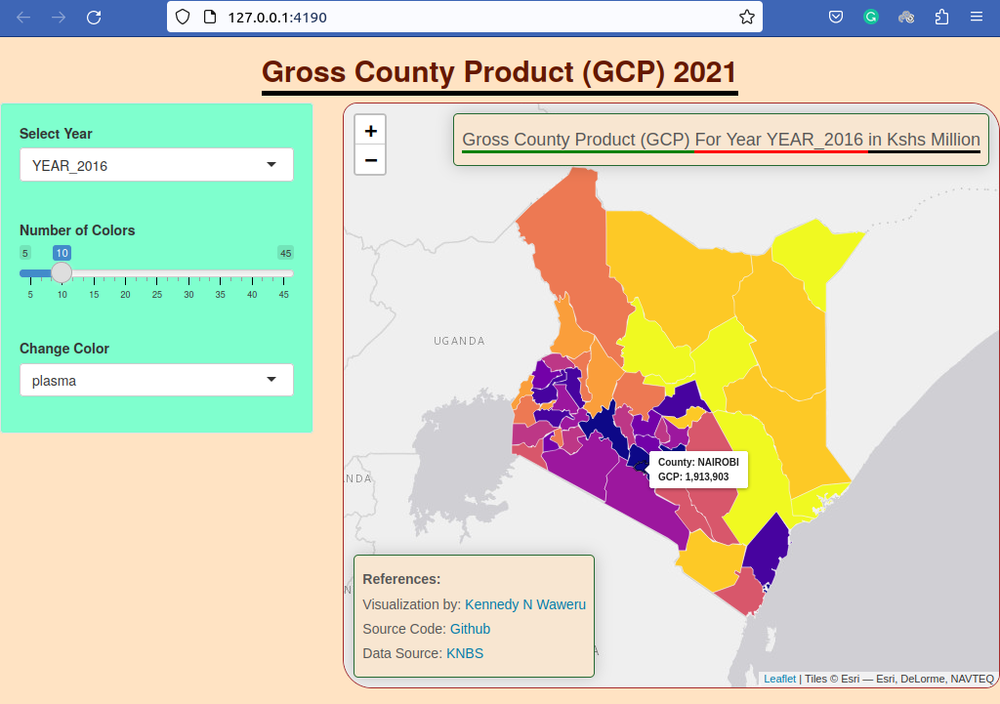
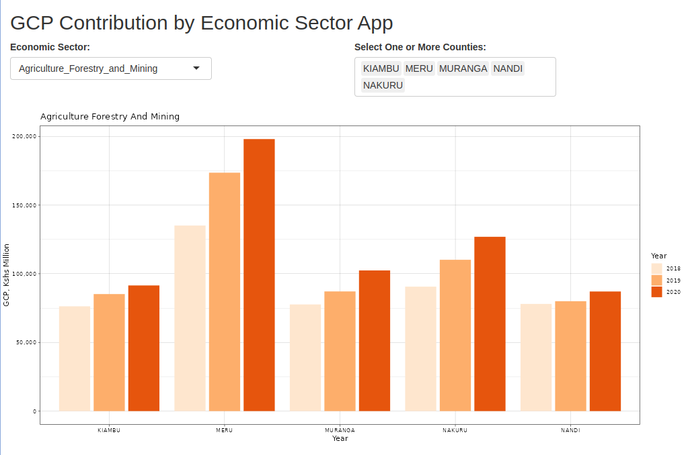

## Tutorial Aims
1. Combine shapefiles with datasets from different source 
2. Visualize county level data on a map using GGplot2
3. Add interactivity in visualization of county level data on a map using Leaflet

## Load in packages

```{r echo=FALSE, results='hide'}
gc()
rm(list=ls())

# set the working directory to the current folder
setwd('/home/ken/Desktop/knbs-gcp')
```


```{r, warning=FALSE, message=FALSE}
# for data wrangling (coming up with new columns, filtering rows...)
library(dplyr) 
# for plotting graphics
library(ggplot2)
# for reading the shapefile
library(rgdal)
# join function for merging datasets
library(plyr)
# interactive map visualization
library(leaflet)
# color palette to show distribution of data
library(RColorBrewer)
```

## The Data

We need two datasets to complete this tutorial:
Kenya Country shapefile with administrative boundaries
KNBS Dataset that has the GCP data that we need to visualize on the shapefile.

### Gross County Product Dataset from KNBS

```{r}
# load in the gcp dataset
gcp_df <- read.csv('datasets/gcp-current.csv', header=TRUE)
gcp_df <- gcp_df[c(1:47),]
names(gcp_df) <- c("COUNTY","YEAR_2013","YEAR_2014","YEAR_2015","YEAR_2016","YEAR_2017","YEAR_2018","YEAR_2019","YEAR_2020")
head(gcp_df)
```

Add a new column for the average GCP for years 2013-2020

```{r}
# calculate average gcp per county for years from 2013 to 2020
gcp_df <- gcp_df %>% 
  mutate(gcp_mean=rowMeans(select(gcp_df, starts_with("YEAR_"))))
head(gcp_df)
```

### Kenya Shapefile

The shapefile data is available in shp format from various sources.
In this case shapefile was obtained from <a href="africaopendata.org/dataset/kenya-counties-shapefile" target="_blank">openAFRICA</a>

Use __rgdal__ package to load in the shapefile and plot it to visualize county level administrative boundaries.

```{r warning=FALSE, results='hide'}
# load in the shapefile
shp <- readOGR(dsn="kenyan-counties", layer="County")
plot(shp)
```

Let's peek on the shp data for any insights.

```{r}
# have a look at the format of the shapefile data
head(shp@data)
```

From the above output, we can see that the __COUNTY__ column of the shp data is in _title_ case. 
Note that in the KNBS GCP dataset the __COUNTY__ column is in _upper case_ thus causing a mismatch.

## Data Cleaning

We start by ensuring that the __COUNTY__ column for both datasets match. We achieve this by converting the shapefile COUNTY column into uppercase.
Then we apply the `setdiff()` function to compare the columns from the two datasets to allow us to see which rows (counties) have mismatching names.

```{r}
# convert shapefile county names to uppercase to match KNBS dataset
shp$COUNTY <- stringr::str_to_upper(shp$COUNTY)

# inspect to ensure shapefile county names match gcp dataset county names
setdiff(shp$COUNTY, gcp_df$COUNTY)
```

The output suggests that three counties have mismatching names and thus need to be fixed.
Update the shapefile county names to ensure that they match names as used in the KNBS GCP dataset.

```{r}

# inconsistencies: KEIYO-MARAKWET, UASIN GISHU, THARAKA, MURANG'A
marakwet_id <- which(shp$COUNTY=="KEIYO-MARAKWET")
shp$COUNTY[marakwet_id] <- "ELGEYO MARAKWET"

tharaka_id <- which(shp$COUNTY=="THARAKA")
shp$COUNTY[tharaka_id] <- "THARAKA NITHI"

muranga_id <- which(shp$COUNTY=="MURANG'A")
shp$COUNTY[muranga_id] <- "MURANGA"

# inspect to ensure that all county names match in both shapefile and the knbs dataset
setdiff(shp$COUNTY, gcp_df$COUNTY)

```

From the above output we see that all counties have matching names and this will ensure that we can join both datasets on the county names.

The code below is used to join the shapefile dataset with the GCP dataset on the __COUNTY__ column.
We also convert the shapefile into a dataframe using the `fortify()` function to make it compatible with __ggplot__ format.

```{r}

shp@data$id <- rownames(shp@data)
shp@data <- join(shp@data, gcp_df, by="COUNTY")

shp_df <- fortify(shp)
kenya_df <- join(shp_df, shp@data, by="id")
```

## Data Visualization

Now that our datasets are clean we can readily visualize the county data on a map.

### Visualize county level data using ggplot

We first come up with a basic ggplot map to visualize county borders before we move to customizing the graphics.

```{r}
# use ggplot to visualize contribution of gcp for various counties
ggplot() +
  geom_polygon(data=kenya_df, aes(long, lat, group=group, fill=gcp_mean), colour="grey", linewidth=0.5) + 
  geom_path(data=kenya_df, aes(long, lat, group=group), color="black", linewidth=0.5)
```

From the above map, it is easy to see that Nairobi County GCP is different from the GCP of other counties with a big range. It is hard to contrast the difference between GCP of different counties with such a disparity in values.

We fix this range problem by converting the GCP values to their natural log using the `log()` function.

Come up with a better ggplot using the log of the average of the gcp

```{r}
# use ggplot to visualize contribution of gcp for various counties
ggplot() +
  geom_polygon(data=kenya_df, aes(long, lat, group=group, fill=log(gcp_mean)), colour="grey", linewidth=0.5) + 
  geom_path(data=kenya_df, aes(long, lat, group=group), color="black", linewidth=0.5) +
  labs(title="Map of County GCP (Using log of GCP)")
```

From the above map we can easily contrast the GCP of different counties. Higher GCP is represented by lighter blue color while lower GCP is represented by dark blue color.

Contrast the color for Nairobi County with that of other counties in the northern region. We can conclude that using the __Natural Log__ of the GCP will enhance the quality of our visualization.

#### Customize Plot Title and Colors for easier readability

Enhance your ggplot to come up with final ggplot map.
This includes using a sequential color palette to allow easy contrast for different values of the GCP.
We also add titles and subtitle that match the KNBS color themes.

Here is the code for the final ggplot map.

```{r}
# final ggplot2 map

ggplot() +
  geom_polygon(data=kenya_df, aes(long, lat, group=group, fill=log(gcp_mean)), colour="grey", linewidth=0.5) + 
  geom_path(data=kenya_df, aes(long, lat, group=group), color="black", linewidth=0.5) +
  scale_fill_distiller(name="Log GCP", palette="YlOrBr")+
  labs(title="Gross County Product Map", subtitle="Average GCP for years 2013 - 2020", caption="Use Natural Log of the GCP to minimize effect of disparity") +
  theme_void() +
  theme(
    plot.title = element_text(hjust=0.5, size=17, face="bold"), 
    plot.caption = element_text(color="#edae49", size=13, hjust=0.5, face="italic"),
    plot.subtitle = element_text(vjust=0.5, hjust=0.5, size=15, face="italic", family="Helvetica", color="brown"))

```

### Visualizing with leaflet
The advantage of using __leaflet__ is that it allows the user to move the cursor on the map and the map provides values for each county where the user's mouse is hovering.

Start by plotting a basic leaflet chart.
To produce a good leaflet chart for Kenya, we need to set constraints for the __latitude__ and __longitude__ that bounds the country. 

Since the country is within the Equator region the latitude ranges from +0 or -0.
For the longitudes we bound it from 33 degrees to 41 degrees.
Given these bounds the output map will focus on the Kenya region.

Try hovering over the country and see the change in county names as you move from one administrative boundary to the next.

```{r}
# create a basic leaflet object to visualize county borders
leaflet() %>% 
  addProviderTiles(providers$Esri.WorldGrayCanvas, group="Default Maptile", options=providerTileOptions(noWrap=TRUE)) %>%
  fitBounds(33.97, -4.471, 41.85688, 3.93726) %>%
  setMaxBounds(32, -3.9, 43, 4.5) %>%
  setView(lng=37.9062, lat=1.00, zoom=6) %>% 
  addPolygons(data=shp, col="blue", weight=1, layerId = ~id, label=~COUNTY)
```

Now that we have successfully produced a leaflet visualization showing the Country we can move ahead to enhance the visualization and also display the different GCP values as recorded on the GCP dataset.

#### Add County GCP Data to the Plot 

Come up with color palette for enhancing contrast
We will use different colors to show the distribution of GCP across different counties. We use a __continuous__ color palette for this task.
In this case the number 25 is chosen randomly and you should try using different values.
```{r}
# use a continuous color palette
qpal <- colorQuantile(rev(viridis::viridis(25,option="G")),
                      shp$YEAR_2013, n=25)
qpal(shp$YEAR_2013)
```

#### Add Informative Labels

When displaying the leaflet we want the user to easily see the GCP values for different counties as they hover over the map.
Create labels to be used when interacting with map to show county values.

```{r}
# create text for county labels
mylabels <- paste(
  "County: ", shp$COUNTY,"<br/>",
  "GCP: ", prettyNum(shp$YEAR_2013, big.mark=",")
) %>% lapply(htmltools::HTML)

# plot title
plot_title <- "<h4>Gross County Product (GCP) For Year 2013, in Kshs Million</h4>"
```

Now that we have the color palette and labels, we move on to create the final leaflet visualization.
Also give the plot a title to allow for intuitive interpretation of the visualized map.

Final Enhanced map

```{r}
# FINAL MAP
leaflet() %>%
  addProviderTiles(providers$Esri.WorldGrayCanvas, group="Default Maptile", options=providerTileOptions(noWrap=TRUE)) %>%
  fitBounds(33.97, -4.471, 41.85688, 3.93726) %>%
  setMaxBounds(32, -3.9, 43, 4.5) %>%
  setView(lng=37.9062, lat=1.00, zoom=6) %>%
  addPolygons(
    data=shp, 
    col="whitesmoke", 
    weight=1,
    label=mylabels,
    labelOptions = labelOptions(
      style=list("font-weight"="bold", padding="3px 8px"),
      direction="auto"
    ),
    layerId = ~id, 
    fillOpacity=1, 
    fillColor=~qpal(YEAR_2013),
    highlightOptions = highlightOptions(
      color="#000000", weight=2,
      bringToFront=TRUE, sendToBack = TRUE
    )
    ) %>% 
  addControl(html=plot_title, position="topright")

```
 

## The Finished Product
Now that we have produced the GCP visualizations we should let the user choose between different years since data provided includes years 2013-2020.

This will be accomplished on a Shiny App.
Below is a preview of the Interactive Shiny app that allows a user to choose between different years and also visualize GCP contribution by different sectors of the economy.

### Interactive Map for GCP



### Inter-County Comparison of GCP by Economic Sector




## Shiny App Link
Visit the Shiny app to explore how different sectors of the economy contributed to the GCP of various counties.
You can also compare top counties per sector.

<a target="_blank" href="https://dasclab.uonbi.ac.ke/shiny/knbs-gcp-shiny-app/">KNBS GCP Shiny App</a>

## References

1. <a target="_blank" href="https://ejooco.github.io/MapStats.github.io/">https://ejooco.github.io/MapStats.github.io/</a>
2. <a target="_blank" href="https://rstudio-pubs-static.s3.amazonaws.com/160207_ebe47475bb7744429b9bd4c908e2dc45.html">https://rstudio-pubs-static.s3.amazonaws.com/160207_ebe47475bb7744429b9bd4c908e2dc45.html</a>